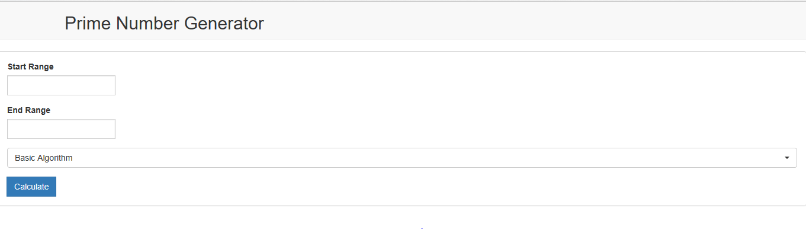
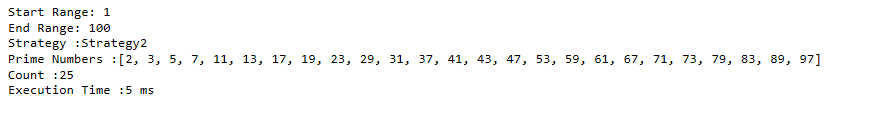
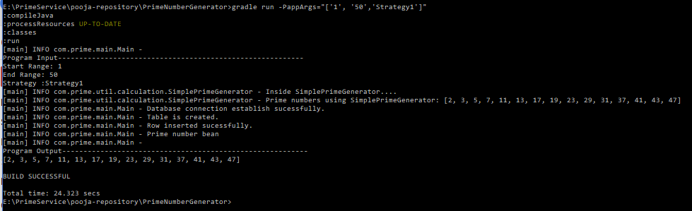

Application for Prime Number Generation
=======================================
Generate the prime numbers based on the range given by user. There are three different strategies used to generate the prime numbers in this application.<br/>
1) Basic Algorithm - It use the simple linear search algorithm to find the prime number. Prime number is a number which is divisible by one and itselt.
There fore it has only two divisor.Algorithm search for the numbers which has two divisor sequencially from startRange to endRange.<br/>
2) Sieve of Eratosthenes Algorithm - In mathematics, the sieve of Eratosthenes is a simple, ancient algorithm for finding all prime numbers up to any given limit.<a href="https://en.wikipedia.org/wiki/Sieve_of_Eratosthenes">
Sieve of Eratosthenes</a><br/>
3) Segmented Sieve Algorithm - The problem with the sieve of Eratosthenes is not the number of operations it performs but rather its memory requirements.For large n, the range of primes may not fit in memory; worse, even for moderate n, its cache use is highly suboptimal. The algorithm walks through the entire array A, exhibiting almost no locality of reference.
A solution to these problems is offered by segmented sieves, where only portions of the range are sieved at a time.
<a href="https://en.wikipedia.org/wiki/Sieve_of_Eratosthenes#Segmented_sieve">Segmented Sieve</a></br>

Prerequisites
------------

You need to have installed a jdk 1.8 or higher and gradle distribution 3.5 or higher.<br/>
Application Server for deploying war file e.g. Apache Tomcat, Glassfish, etc.

Description
------------
The application contains two projects <br/>
* PrimeNumberGenerator - Standalone Application
* PrimeGeneratorService - Restful Web Service 

Execution of PrimeGeneratorService
----------------------------------
This application uses PrimeNumberGenerator application as its dependencies to reuse the functionalities. Dependency is added using gradle.This application needs to be deployed on application server. To generate war of this application use following command in the project directory.
The PrimeGeneratorService.war will be generated inside build/libs/
```bash

gradle clean build

# windows:
gradlew clean build
```

If Apache tomcat is used then copy this war and paste it under apache-tomcat-directory/webapps folder and restart server.
Or if any other server is used then deploy the war file accordingly.

The application can be accessed using two methods :

* Web User Interface : URL to access your the application : http://hostname:port/PrimeGeneratorService/ <br>
e.g. http://localhost:8080/PrimeGeneratorService/




Sample Output will look like following :




Execution of PrimeNumberGenerator -Standalone
---------------------------------------------
This is standalone application for the generation of prime numbers. To run this application use following command in the project directory.
```bash

gradle run -PappArgs="['1', '50','Strategy1']"

```
* Strategy1 uses Basic Algorithm.
* Strategy2 uses Sieve of Eratosthenes Algorithm.
* Strategy3 uses Segmented Sieve Algorithm.

Sample Output will look like following :


